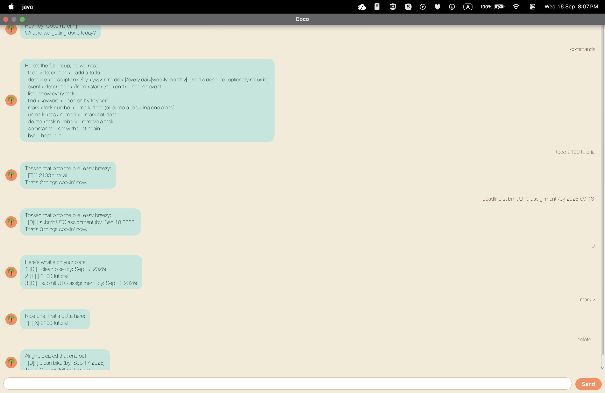

# Coco User Guide



Coco is a desktop chatbot for keeping track of your tasks — todos, deadlines
(including recurring ones), and events — via quick, typed commands. It comes
with both a **GUI** and a plain-text **CLI**, and it remembers your task list
between sessions automatically.

## Quick start

1. Make sure you have **Java 25** installed.
2. Grab the latest `coco.jar` (see the project's GitHub releases, or build it
   yourself with `./gradlew shadowJar`).
3. Copy `coco.jar` into an empty folder.
4. Open a terminal in that folder and run:
   ```
   java -jar coco.jar
   ```
   This launches the GUI. Coco greets you and is ready for commands.

Your tasks are saved automatically to a `data/coco.txt` file next to the jar
after every change, and reloaded the next time you start Coco.

## Command format

Every command is one line, typed into the input box (GUI) or the terminal
(CLI), starting with the command word in **lowercase** — commands are
case-sensitive, so `Bye` or `LIST` won't be recognised. Anything in `<angle
brackets>` is something you fill in; anything in `[square brackets]` is
optional.

## Features

### Adding a todo: `todo`

A todo is a task with just a description — no date attached.

Example: `todo read book`

```
Tossed that onto the pile, easy breezy:
  [T][ ] read book
That's 1 things cookin' now.
```

### Adding a deadline: `deadline`

A deadline is a task due by a specific date.

Format: `deadline <description> /by <yyyy-mm-dd>`

Example: `deadline return book /by 2019-10-15`

```
Tossed that onto the pile, easy breezy:
  [D][ ] return book (by: Oct 15 2019)
That's 1 things cookin' now.
```

**Recurring deadlines:** add `/every daily`, `/every weekly`, or `/every
monthly` to make a deadline repeat.

Example: `deadline standup /by 2026-01-06 /every daily`

```
Tossed that onto the pile, easy breezy:
  [D][ ] standup (by: Jan 06 2026) (every: daily)
That's 2 things cookin' now.
```

> [!TIP]
> Marking a recurring deadline done doesn't complete it — see
> [Marking/unmarking tasks](#markingunmarking-a-task-mark-unmark) below.

### Adding an event: `event`

An event spans a start and an end time.

Format: `event <description> /from <start> /to <end>`

Example: `event project meeting /from Mon 2pm /to 4pm`

```
Tossed that onto the pile, easy breezy:
  [E][ ] project meeting (from: Mon 2pm to: 4pm)
That's 3 things cookin' now.
```

### Listing all tasks: `list`

Shows every task, numbered from 1.

Example: `list`

```
Here's what's on your plate:
1.[T][ ] read book
2.[D][ ] return book (by: Oct 15 2019)
3.[E][ ] project meeting (from: Mon 2pm to: 4pm)
```

### Finding tasks by keyword: `find`

Shows only the tasks whose description contains the given keyword
(case-insensitive).

Example: `find book`

```
Here's what I dug up:
1.[T][ ] read book
2.[D][ ] return book (by: Oct 15 2019)
```

### Marking/unmarking a task: `mark`, `unmark`

`mark <task number>` marks a task as done; `unmark <task number>` reverts it.
Task numbers refer to the current `list`/`find` numbering.

Example: `mark 1`

```
Nice one, that's outta here:
  [T][X] read book
```

Example: `unmark 1`

```
Ah, bringing it back, huh? Marked as not done:
  [T][ ] read book
```

**Marking a recurring deadline** doesn't complete it — it advances to its
next occurrence instead, since a repeating task never really "finishes":

```
That one's on repeat, so I bumped it to the next round instead of calling it done:
  [D][ ] standup (by: Jan 07 2026) (every: daily)
```

### Deleting a task: `delete`

Removes a task from the list entirely.

Example: `delete 3`

```
Alright, cleared that one out:
  [E][ ] project meeting (from: Mon 2pm to: 4pm)
That's 2 things left on the pile.
```

### Viewing all commands: `commands`

Prints this same command reference, right inside the app.

Example: `commands`

```
Here's the full lineup, no worries:
  todo <description> - add a todo
  deadline <description> /by <yyyy-mm-dd> [/every daily|weekly|monthly] - add a deadline, optionally recurring
  event <description> /from <start> /to <end> - add an event
  list - show every task
  find <keyword> - search by keyword
  mark <task number> - mark done (or bump a recurring one along)
  unmark <task number> - mark not done
  delete <task number> - remove a task
  commands - show this list again
  bye - head out
```

### Exiting: `bye`

Ends the session (and closes the GUI window shortly after).

Example: `bye`

```
Catch you on the flip side! 🌊
```

## Command summary

| Command | Format | Example |
|---|---|---|
| Add a todo | `todo <description>` | `todo read book` |
| Add a deadline | `deadline <description> /by <yyyy-mm-dd> [/every daily\|weekly\|monthly]` | `deadline return book /by 2019-10-15` |
| Add an event | `event <description> /from <start> /to <end>` | `event meeting /from Mon 2pm /to 4pm` |
| List tasks | `list` | `list` |
| Find tasks | `find <keyword>` | `find book` |
| Mark done | `mark <task number>` | `mark 2` |
| Unmark done | `unmark <task number>` | `unmark 2` |
| Delete a task | `delete <task number>` | `delete 3` |
| Show commands | `commands` | `commands` |
| Exit | `bye` | `bye` |
